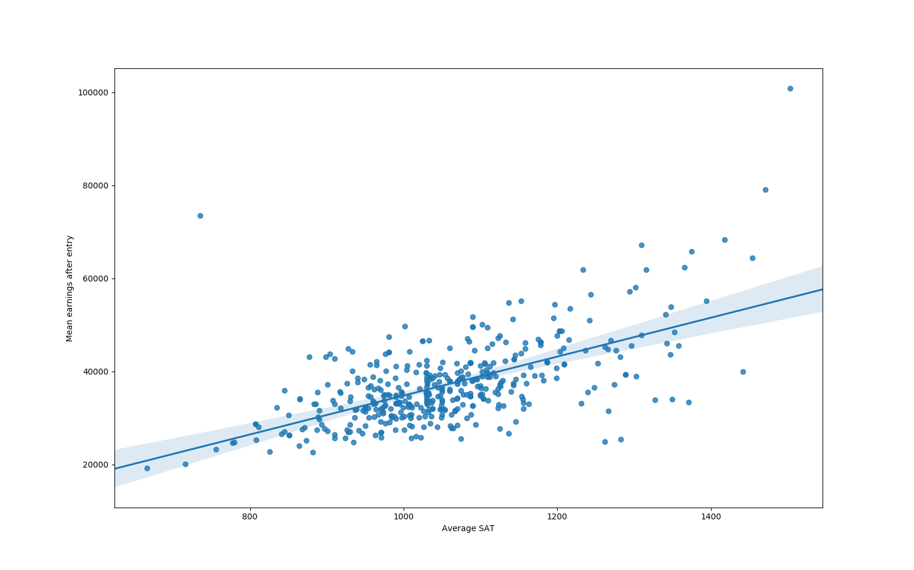

# How much value a college adds?

It is widely believed that people's success is invariant under a choice of college. 
In other words, smart people will succeed no matter which college they go to. 

In this project we attempt to support/falsify this hypothesis via a very simple analysis. 
We use College Scorecard Data https://collegescorecard.ed.gov/data/. It is a big data set containing 
various information (1825 features) about 6478 colleges in the USA over 19 years (1996-97 to 2015-16).

The idea is to factor out students' qualities, which in case of this dataset are represented as SAT scores. 
To do so we build a simple linear regression model predicting earnings based on SAT scores. 
This allows us to generate a very simple "normalized" college ranking via dividing an actual earnings 
by a predicted via linear regression earnings based on SAT.

Linear regression performace is characterized by `R squared` and the model's coefficients represent correlations between input features and the ouput. The below results show that SAT scores alone predict earnings pretty well, especially its SAT Math.
```
Coefficients:
 [[ 22900.75770752 -39526.81071915  52229.04112271]]

R squared: 0.4323
Features: ['SAT_AVG_ALL', 'SATVRMID', 'SATMTMID']
Number of examples: 8015

'SAT_AVG_ALL', # Average SAT equivalent score of students admitted for all campuses
'SATVRMID', # Midpoint of SAT scores at the institution (critical reading)
'SATMTMID' # Midpoint of SAT scores at the institution (math)
```


Top ten colleges in our ranking are:
```
Charles R Drew University of Medicine and Science
Albany College of Pharmacy and Health Sciences
Maine Maritime Academy
MCPHS University
MOUNT SAINT MARYS COLLEGE
Benedictine University
Albertus Magnus College
Harvard University
Stanford University
Massachusetts Institute of Technology
```

Another thing we can do is to answer the following question: what college features contribute to student earnings the most after factoring out SAT? In other words, we can can build another model predicting the normalized earnings based on college features, we call this "college model".

`R squared` and coefficients for this model are:
```
Coefficients:
 [[ 0.01029673  0.62380574  0.0756638  -0.30289539 -0.07458631  0.18591655
  -0.08744855  0.03828624  0.04916231]]

R squared: 0.1447
Features: ['ADM_RATE_ALL', 'AVGFACSAL', 'TUITIONFEE_IN', 'TUITIONFEE_OUT', 'PFTFAC', 'GRADS', 'CONTROL_0', 'CONTROL_1', 'CONTROL_2']
Number of examples: 6536

'ADM_RATE_ALL',  # admission rate
'AVGFACSAL',  # faculty salary
'TUITIONFEE_IN',  # In-state tuition and fees
'TUITIONFEE_OUT',  # Out-of-state tuition and fees
'PFTFAC',  # Proportion of faculty that is full-time
'GRADS',  # Number of graduate students
'CONTROL',  # Control of institution (public, private nonprofit, public for profit)
```

# Usage

Download and unzip dataset:
```
wget https://ed-public-download.app.cloud.gov/downloads/CollegeScorecard_Raw_Data.zip; unzip CollegeScorecard_Raw_Data
```
Trian a student model:
```
python models.py --task
```

Generate ranking (creates `scores.csv`):
```
python models.py --task scores
```

Train a college model:
```
python models.py --task college
```

P.S.: By default the code uses linear regression from `sklearn`, but one can specify `--model_type keras` to use `keras` 
models, which are more flexible and can be easily generalized to different types of neural networks. 

P.S.S.: Student `sklearn` and `keras` models are equivalent, but college `keras` model performs worse (TODO: resolve). 
